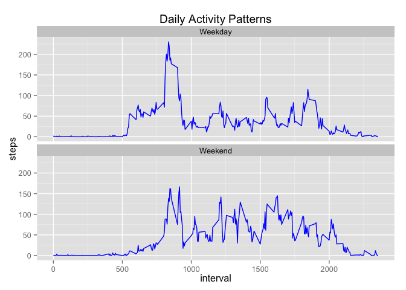

# PA1_template.Rmd
A Zabrodski  
June 9, 2015  

Reproducible Research: Peer Assignment 1
=========================================

###Step 1: Reading the Data###

It is assumed that the dataset is in the working directory under it's original name "activity.csv" from the forked GitHub repository


```r
step_data <- read.csv("activity.csv")
```

The data is in a readable format, so no transformation necessary at this point.

###Step 2: What is the Total Number of Steps Taken Per Day?###

1. Calculate stpes taken each day

First need to aggreagate the steps based on date. Will use the reshape2 package to accomplish this using steps as the variable, then remove the NAs using complete.cases.


```r
library(reshape2)
narrow <- melt(step_data, measure.vars = "steps") # Converts to narrow format
by_day <- dcast(narrow, date ~ variable, sum) # Sums steps for each date
by_day <- by_day[complete.cases(by_day),]
head(by_day,5)
```

```
##         date steps
## 2 2012-10-02   126
## 3 2012-10-03 11352
## 4 2012-10-04 12116
## 5 2012-10-05 13294
## 6 2012-10-06 15420
```

2. Make a histogram of the total number of steps taken each day

Use the ggplot2 package to make a histogram of steps taken each day.


```r
library(ggplot2)
plot <- ggplot(data = by_day, aes(by_day$steps)) + geom_histogram(breaks = seq(0,25000, by = 1250), col = "red", fill = "blue", alpha = 0.5) + labs(title = "Histogram of Steps per Day") + labs(x="Steps", y="Count") + ylim(c(0,20))
plot
```

 

3. Calculate and report the *mean* and *median* total number of steps taken per day


```r
mean(by_day$steps)
```

```
## [1] 10766.19
```

```r
median(by_day$steps)
```

```
## [1] 10765
```

The mean number of steps is 10,766.19 per day and the median number of steps is 10,765 per day

###Step 3: What is the Average Daily Activity Pattern?###

1. Make a time series plot of the 5-min interval (x-axis) and the average number of steps taken, averaged across all days (y-axis)

Need to aggregate the number of steps again, but this time take the average number of steps for all the days at each time interval. Ignoring NAs this time as well, but they must be removed before using the mean function. 


```r
library(reshape2)
narrow <- melt(step_data, measure.vars = "steps") # Converts to narrow format
narrow <- narrow[complete.cases(narrow),] # Must remove NAs before using mean function
by_int <- dcast(narrow, interval ~ variable, mean) # Sums steps for each date
head(by_int,5)
```

```
##   interval     steps
## 1        0 1.7169811
## 2        5 0.3396226
## 3       10 0.1320755
## 4       15 0.1509434
## 5       20 0.0754717
```

Plot the data


```r
library(ggplot2)
plot2 <- ggplot(by_int, aes(interval, steps)) + geom_line() + xlab("Time of Day (5-min Interval)") + ylab("Steps Taken") + labs(title = "Average Steps Per 5 Min Interval") + geom_line(lwd = 1, col = "orange")
plot2
```

 

2. Which 5-minute interval, on average across all the days in the dataset, contains the maximum number of steps?

Use the which.max() function to find the index for where the maximum occurs, then find the interval value for the index value


```r
by_int$interval[which.max(by_int$steps)]
```

```
## [1] 835
```

On average, the most steps occur between 8:35 AM and 8:40 AM every day

###Step 4: Imputing Missing Values###

1. Calculate and report the total number of missing values in the dataset

Use the complete.cases function to form a table

```r
table(complete.cases(step_data))
```

```
## 
## FALSE  TRUE 
##  2304 15264
```

There are 2304 rows that contain a NA

2. Devise a strategy for filling in all of the missing values in the dataset

Will use the data from step 3 to impute the missing values with the average number of steps for that time interval.

3. Create a new dataset that is equal to the original dataset but with the missing data filled in

Assign step data to a new data frame, then loop through it's values, check for NAs, then reassign any NA with the average number of steps from interval average data frame. Remember, that by_int was the the average steps by time interval. 


```r
imputed_data <- step_data
for (i in 1:nrow(imputed_data)){
        if (is.na(imputed_data$steps[i]) == TRUE){
                int <- imputed_data$interval[i]
                index <- by_int[by_int$interval == int,]
                imputed_data$steps[i] <- index$steps
        }
}
```

4. Make a histogram of the total number of steps taken each day and Calculate and report the mean and median total number of steps taken per day. Do these values differ from the estimates from the first part of the assignment? What is the impact of imputing missing data on the estimates of the total daily number of steps?


```r
narrow_imp <- melt(imputed_data, measure.vars = "steps") # Converts to narrow format
by_day_imp <- dcast(narrow_imp, date ~ variable, sum) # Sums steps for each date

# Make plot
plot3 <- ggplot(data = by_day_imp, aes(by_day_imp$steps)) + geom_histogram(breaks = seq(0,25000, by = 1250), col = "orange", fill = "blue", alpha = 1) + labs(title = "Histogram of Steps per Day (Imputed)") + labs(x = "Steps", y = "Count") + ylim(c(0,20))
plot3
```

 

```r
mean(by_day_imp$steps)
```

```
## [1] 10766.19
```

```r
median(by_day_imp$steps)
```

```
## [1] 10766.19
```

Using the average for each time interval to impute missing values resulted in an increase in the most frequent bin (the one containing the average) of the histogram. There was no change to the average (because the average was repeated for missing values) and no significant change to the median. 

###Step 5: Are There Differences in Activity Patterns Between Weekdays and Weekends?###

1. Create a new factor variable in the dataset with two levels -- "weekday" and "weekend" indicating whether a given date is a weekday or weekend day

The date column class is a factor, first we must change it to being a date. Then add column to the data frame to indicate if the date is a weekday. Will use the chron package to add a boolean weekend vector to the data frame. Then loop through and change the boolean to a more descriptive character


```r
library(chron)
imputed_data$date <- as.Date(imputed_data$date)
imputed_data$weekend <- chron::is.weekend(imputed_data$date)
for (i in 1:nrow(imputed_data)){ 
        if (imputed_data$weekend[i] == FALSE){
                imputed_data$weekend[i] <- "Weekday" 
                }
                else {
                      imputed_data$weekend[i] <- "Weekend"  
                }
        }
imputed_data$weekend <- as.factor(imputed_data$weekend)
```

2. Create a panel plot comparing the weekday to weekend data to see if there is a difference average steps taken per day

Need to modify the data into weekend and weekday averages


```r
library(reshape2)
by_day_narrow <- melt(imputed_data, measure.vars = "steps") # Converts to narrow format
week_int <- dcast(by_day_narrow, interval + weekend ~ variable, mean) 
```

Then use the same plot type as Step 3 to create a panel plot comparing the weekday and weekend data


```r
plot4 <- ggplot(week_int, aes(interval, steps)) + geom_line(color = "blue") + facet_wrap(~weekend, nrow = 2) + ggtitle("Daily Activity Patterns")
plot4
```

 

The plot illustrates that there is a substantial increase in daytime activity as measured by steps per 5 min interval on the weekends in comparison to weekdays. This suggests the data from the person in question has a sedentary desk job. 
